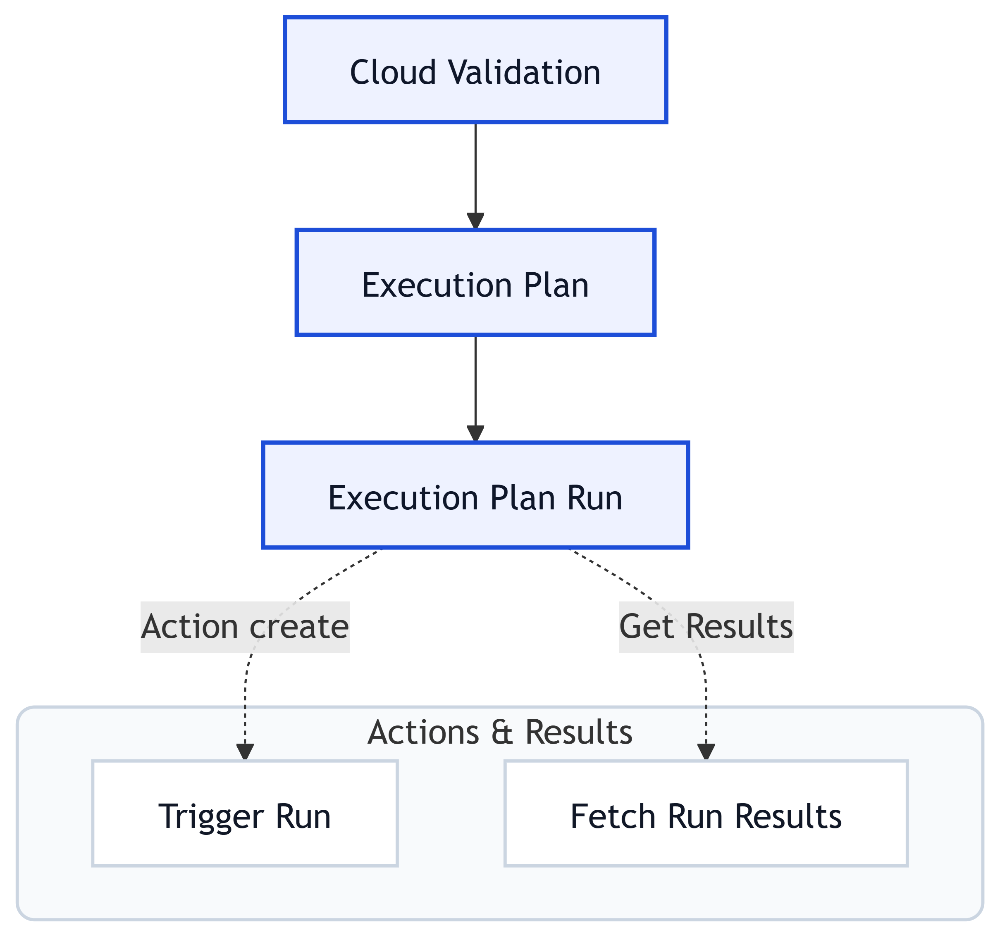
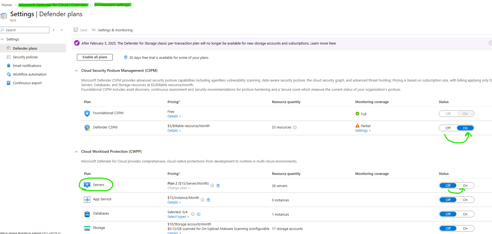
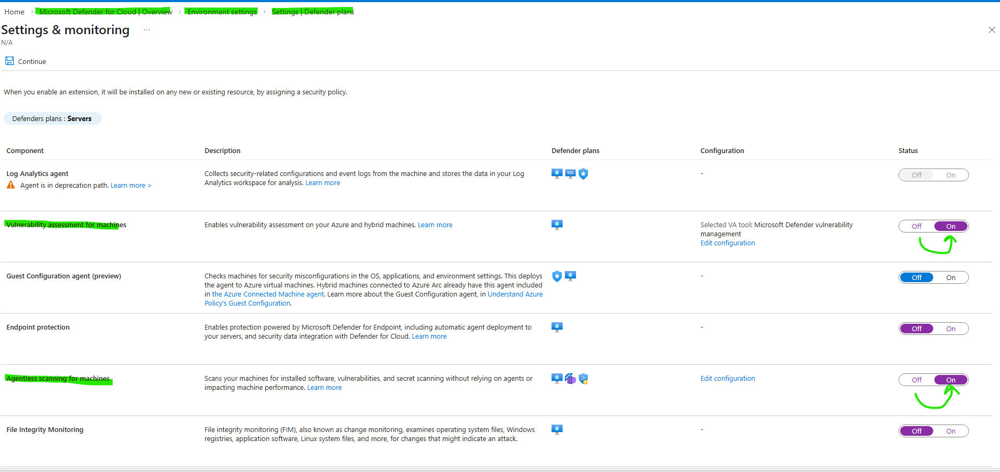
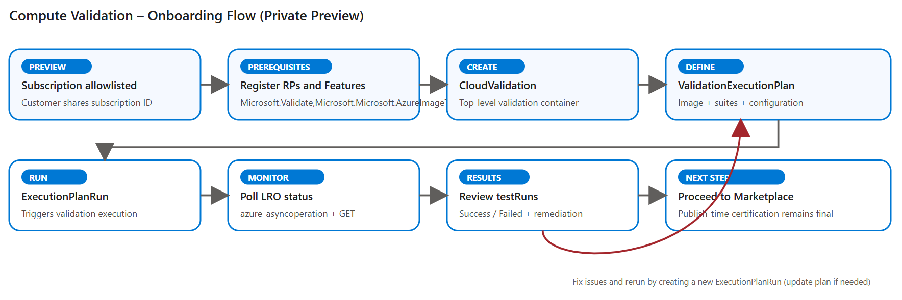

# Compute Validation For VM Image (Private Preview)

**Confidential – Private Preview**

**Compute Validation for VM Image** service is in private preview. Please reach out to computevalidationonboardingsupport@microsoft.com for onboarding.

---

## 1. Overview

Compute Validation is a self-serve validation service for VM Images that enables customers to **pre-validate Virtual Machine (VM) images** (validate images before deploying on Azure or sharing with others) using the same validation infrastructure that protects the Azure Marketplace. The capability is exposed via the **Compute Validation Resource Provider (`Microsoft.Validate`)** and allows customers to run security and quality validations directly from their own CI/CD workflows **prior to image publication**.

Key objectives of Compute Validation includes:

- Shifting validation **left** to identify issues earlier in the image lifecycle
- Reducing iteration cycles during Azure Marketplace submission
- Providing deterministic, API-driven validation results
- Preserving the existing **final certification gate** at publish time

**Note:** Compute Validation for VM Image complements—but does not replace—Azure Marketplace certification. Results are intended for **early signal and remediation** only; publish-time certification remains authoritative.

---

## 2. Private Preview Scope

This private preview provides:

- ARM-based APIs for VM image validation
- Support for a limited set of validation suites
- Execution in a constrained set of Azure regions
- **Customers could reach out to us at computevalidationsupport@microsoft.com in case of any issues or to share any feedback.**

Out of scope:

- Public documentation or GA support
- Service-level agreements (SLAs)
- Sovereign or national clouds

---

## 3. Architecture and Resource Model



- **CloudValidation (CV)**: Top-level resource that scopes validation activity.
- **ValidationExecutionPlan (EP)**: Defines image, OS, architecture, and test suites.
- **ExecutionPlanRun (EPR)**: Executes a plan and captures results.

---

## 4. Prerequisites and One-Time Setup

### 4.1 Subscription Allowlisting

Your Azure subscription must be **allowlisted** for the private preview. Share the **subscription ID** with the Compute Validation onboarding team.

### 4.2 Azure CLI

Azure CLI is required.

```powershell
powershell.exe -ExecutionPolicy Bypass -File .\Install-AzureCLI.ps1
az version
```

### 4.3 Register Features and Providers

To Register the RP and Advanced Linux Test Validation some of the tests needs to be completed. Running the below script will do the 1 time setup and configure the subscription to run the Validation Test

**Note**:
Owner access is required to enable Defender for Cloud settings for Vulnerability Validation. (see section 4.3.1)

For windows, you can use poweshell:
```powershell
powershell.exe -ExecutionPolicy Bypass -File .\WindowsPreReqScripts\ComputeValidationOnBoardingScript
```
For other OS, use python:
```python
python3 ./LinuxPrereqScripts/ComputeValidationOnBoardingScript.py  --subscription-id <subscriptionId>
```

Wait until feature state is `Registered`.

#### List of setup the above scripts do


1. Registration of Validation RP And Advanced Linux Test: The above script will register and enable the Image Validation RP in your subscription.
2. Registration of RP (Resource Providers/Functionality) like Microsoft.Compute, Microsoft.Storage etc on which the Image Validation RP/Service is dependent on.
3. This also find out the AzValidation RP Service Principle and print it in the logs . you can serach the string "Validate RP SP objectId " and store the value.
3. Granting permissions on Subscription to run Advanced Linux Test cases: The script will create roles with certain permission and assign it your subscription, so that Linux Test can be run on the subscription.
4. Enable Microsoft Defender for Servers Plan 2 with Agentless VM Scanning and Vulnerability Assessment: The script will automatically enable Microsoft Defender for Cloud on your subscription for vulnerability scanning of VM images.


#### 4.3.1 Enable Microsoft Defender for Vulnerability Scanning

To ensure comprehensive vulnerability validation of your VM images, **enable Microsoft Defender for Cloud** on your subscription. Follow the official documentation to configure Defender for vulnerability scanning:

**📖 Documentation:** 
- [Enable Microsoft Defender for Servers - Vulnerability Assessment](https://learn.microsoft.com/en-us/azure/defender-for-cloud/deploy-vulnerability-assessment-defender-vulnerability-management)
- [Enable Agentless Scanning for VMs](https://learn.microsoft.com/en-us/azure/defender-for-cloud/enable-agentless-scanning-vms#enable-agentless-scanning-on-azure)

**Quick Setup Guide:**


*Figure 1: Enable Microsoft Defender for Servers on your subscription*


*Figure 2: Configure vulnerability assessment settings and agentless scanning*

> **Note:** The onboarding script (Section 4.3) will include PowerShell commands to automate enabling Defender for your subscription.

---

## 5. How to Get Started

**Step 1: Confirm access:**
- Confirm preview access and prerequisites(once you have completed ).

**Step 2: Prepare Your Image:**

Prepare image (VHD SAS URI, ensure minimum 1 day expiry is provided to the VHD, make sure to give read and list access to the VHD).

**Step 3: Create Validation Resources and define the tests to run:**
- Use ARM APIs directly, or
- Deploy the provided ARM template using the automation command below: the arm paramter file demands AzValidation RP service principle which you captured 4.3 steps. You can also again run the below command to get it 
``` az ad sp show --id f877b90d-59ee-40e3-8d2c-215dae4c80d8 --query id -o tsv ```

```powershell
az deployment sub create   --name computevalidation-onboarding   --location <location>   --template-file .\computevalidation.subscription.template.json   --parameters .\computevalidation.subscription.parameters.json
```
This will:
- Create a CloudValidation
- Define a ValidationExecutionPlan containing the test environment details along with a list of tests to execute
- Trigger an ExecutionPlanRun - As part of the ExecutionPlanRun few resources will be created under <cloudvalidationName>-mrg resource group for example storage account, virtual machine to validate whether VM will boot up on the VHD provided, at the end of the run, these should get cleaned up.

**Make sure to note down the names of CloudValidation,ValidationExecutionPlan and ExecutionPlanRun, You will need those in next step.**

**Step 4: Monitor Execution:**
- Validation runs asynchronously
- Poll the ExecutionPlanRun resource until it reaches a terminal state. Wait until the provision state of ExecutionPlanRun has changed to succeeded.

**Step 5: Review Results:**
- To fetch the test results, run the script named GetResults.ps1.
- Review `testRuns` fields, fix issues, re-run as needed with a new ExecutionPlan definition, this could be with a reduced number of tests basis the failures observed that require a rerun.

For windows, use poweshell:
```powershell
powershell.exe -ExecutionPolicy Bypass -File .\GetResults.ps1
```
For other OS, use python:
```python
python3 ./LinuxPrereqScripts/GetResults.py  \
  --subscription-id "subscription" \
  --resource-group "resource-group" \
  --cloud-validation "cloud-validation" \
  --validation-execution-plan "validation-execution-plan" \
  --execution-plan-run "execution-plan-run" \
  --pretty

```



This diagram shows the end-to-end onboarding and execution flow for
Compute Validation for VM Image during Private Preview.

---

## 6. Supported Inputs and Environments

- **Image Sources**: VHD (SAS Uri)
- **OS**: Windows, Linux
- **Architectures**: x86, x64, ARM64
- **Regions**: `southcentralus` (prod)
- **Cloud**: Azure Public Cloud

---

## 7. Validation Results

Results are available in the `testRuns` array of an ExecutionPlanRun.

- `Success` does **not** imply Marketplace publish readiness.
- Failures should be remediated and revalidated.

---

## 8. Supported Validation Suites (Preview)

- Malware Scan
- Boot Validation
- Linux Quality Validations ([LISA tests](https://aka.ms/lisa))
- Vulnerability Scan (Microsoft Defender)

## 8.1 API Specification (Swagger / OpenAPI)

Compute Validation for VM Image APIs are exposed via Azure Resource Manager
through the `Microsoft.Validate` resource provider.

The complete API contract is provided as an **OpenAPI (Swagger) specification**
and is the authoritative reference for:

- Resource schemas
- Request / response payloads
- Long‑running operation (LRO) semantics
- Error models

### Swagger File

- **OpenAPI (JSON)**:  
  [`api/computevalidation-selfserve.openapi.json`](./api/computevalidation-selfserve.openapi.json)

- **REST API Reference (human-readable)**:  
  [`docs/rest-api/index.md`](./docs/rest-api/index.md)

> Customers should rely on the Swagger spec for exact request shapes and API versions.
> For a human-readable, operation-by-operation reference with examples, see the [REST API Reference](./docs/rest-api/index.md).
> Documentation examples in this guide are illustrative only.

### Key Resource Types

- `Microsoft.Validate/cloudValidations`
- `Microsoft.Validate/cloudValidations/validationExecutionPlans`
- `Microsoft.Validate/cloudValidations/validationExecutionPlans/executionPlanRuns`

All operations follow standard Azure ARM patterns, including:

- PUT‑based create/update
- Asynchronous execution
- `azure-asyncoperation` polling

---

## 9. Validation Test Case Coverage

This section provides visibility into the **individual test cases** executed
as part of each validation suite during self‑serve image validation.

> Test coverage may evolve during the private preview. Final certification
> at Marketplace publish time remains authoritative.

### 9.1 How to pass the testcase list in the request

> **Note:** For the list of available LinuxQualityValidations tests, see [Test Cases — Linux Integration Services Automation (LISA) documentation](https://mslisa.readthedocs.io/en/latest/test_cases.html).

#### Readable test configuration (logical structure)

The following shows the logical structure of the test configuration
used to select validation suites and individual test cases.

```json
{
  "certificationPackageReference": {
    "osType": "Linux",
    "architectureType": "X64"
  },
  "storageProfile": {
    "osDiskImage": {
      "sourceVhdUri": "<SAS_URI_TO_VHD>"
    }
  },
  "validations": {
    "BasicVMValidation": {
      "testNames": ["VM-Boot-Test"]
    },
    "MalwareValidation": {},
    "VulnerabilityValidation" : {},
    "LinuxQualityValidations": {
      "concurrency": 3,
      "testSuite": [
        {
          "testNames": [
            "smoke_test",
            "validate_netvsc_reload",
            "verify_no_pre_exist_users",
            "verify_dns_name_resolution",
            "verify_mdatp_not_preinstalled",
            "verify_deployment_provision_premium_disk",
            "verify_deployment_provision_standard_ssd_disk",
            "verify_deployment_provision_ephemeral_managed_disk",
            "verify_deployment_provision_synthetic_nic",
            "verify_reboot_in_platform",
            "verify_stop_start_in_platform",
            "verify_bash_history_is_empty",
            "verify_client_active_interval",
            "verify_no_swap_on_osdisk",
            "verify_serial_console_is_enabled",
            "verify_openssl_version",
            "verify_azure_64bit_os",
            "verify_waagent_version",
            "verify_python_version",
            "verify_omi_version"
          ],
          "testArea": [],
          "testCategory": [],
          "testTags": [],
          "testPriority": []
        }
      ]
    }
  }
}
```

#### ValidationExecutionPlan request body (actual ARM payload)

In the ARM request, the test configuration is provided as a **string**
via the `planConfigurationJson` property.

```json
{
  "properties": {
    "description": "Self-serve validation for Linux image"
    "planConfigurationJson": "{\n  \"certificationPackageReference\": {\n    \"osType\": \"Linux\",\n    \"architectureType\": \"X64\"\n  },\n  \"storageProfile\": {\n    \"osDiskImage\": {\n      \"sourceVhdUri\": \"<SAS_URI_TO_VHD>\"\n    }\n  },\n  \"validations\": {\n    \"MalwareValidation\": {},\n    \"BootValidation\": {\n      \"testNames\": [\n        \"VM-Boot-Test\",\n        \"Boot-Diagnostics-Available\"\n      ]\n    },\n    \"LinuxQualityValidations\": {\n      \"concurrency\": 3,\n      \"testSuite\": {\n        \"testNames\": [\n          \"verify_dns_name_resolution\",\n          \"verify_stop_start_in_platform\",\n          \"verify_reboot_in_platform\",\n          \"verify_no_pre_exist_users\",\n          \"verify_ssh_access\"\n        ]\n      }\n    }\n  }\n}"
  }
}
```

> **Note**
>
> - `planConfigurationJson` **must be a string** in the ARM request.
> - The readable JSON above is shown for clarity only.
> - When modifying test cases, update the ValidationExecutionPlan and
>   create a **new ExecutionPlanRun** to re-execute validation.
> - Test execution is **non‑destructive** to customer images.
> - Failures are reported with actionable remediation guidance.
> - Customers may re‑run validation after remediation by creating a new

## `ExecutionPlanRun`.

---

## 10. Cost & Resource Ownership
During each ExecutionPlanRun, Azure resources (VMs, disks, storage, networking) are created in your subscription and are billed at standard Azure rates.
The service attempts best‑effort cleanup after completion.
Customers are responsible for reviewing and deleting any orphaned resources, especially in failure scenarios.

---

## 11. Known Limitations

- Limited regions
- Transient platform failures possible
- **No cancellation of running validations**: Once an ExecutionPlanRun is triggered, it cannot be cancelled. If misconfigured or triggered unintentionally, the run will continue until completion and may incur costs.

---

## 12. Automation via ARM Template

```powershell
az deployment sub create   --name computevalidation-onboarding   --location <location>   --template-file .\computevalidation.subscription.template.json   --parameters .\computevalidation.subscription.parameters.json
```

---

## 13. Quota and Resource Prerequisites

Compute Validation provisions Azure resources **in the customer's subscription** to execute validation workloads.  
Sufficient **compute, storage, and regional quota** must be available prior to triggering a validation run.

### BasicVMValidation

`BasicVMValidation` performs fundamental functional checks (for example, VM boot validation). As part of performing BasicVMValidation, Compute Validation provisions temporary Azure resources in the customer's subscription to execute these tests.

#### Resources Provisioned
During execution, Compute Validation creates:
- A **Virtual Machine**
  - Default size: `Standard_DS2_v2`
- A **Storage Account**
  - Used for test artifacts and intermediate validation data

#### Quota Considerations
- Successful execution depends on the availability of **compute cores and storage quota** in the selected region.
- If the **default VM size cannot be provisioned** due to:
  - Regional capacity constraints, or
  - Subscription quota limitations  
  - A **recommended VM size must be explicitly provided** in the validation request.

#### Failure Scenarios
- Insufficient quota may result in **validation failures during resource provisioning**, before test execution begins.

### LinuxQualityValidations (LISA)

`LinuxQualityValidations` executes Linux quality test cases as defined by [**LISA**](https://aka.ms/lisa).

Before triggering these validations, customers should ensure that **sufficient resources are available** to run the required LISA test suites.

#### Recommended Quota Guidance

The table below lists **recommended resource availability** for running [**LISA T4 test cases**](https://mslisa.readthedocs.io/en/latest/run_test/microsoft_tests.html#test-tier) with a **concurrency of 2**.  
Customers may use this as **guidance** when planning quota requirements. 
> **Note:** LISA tests currently run in the **West US 2 (`westus2`)** region. Work is in progress to consolidate all tests into a single region.

| Resource SKU Family | Cores Count | Feature / Capability |
|--------------------|-------------|----------------------|
| Standard BS Family | 34 | General |
| Standard DSv2 Family | 328 | General |
| Standard DADSv5 Family | 52 | Hibernation |
| Standard LSv2 Family | 256 | NVMe |
| Standard NCsv3 Family | 60 | GPU |
| Standard HBv3 Family | 16 | HPC |
| Standard FSv2 Family | 288 | DPDK (isolated resource required) |
| Standard MSv2 Family | 416 | Kdump |
| Standard EADSv5 Family | 2 | General (minimum VM size with 6 data disks) |
| Standard DCADCCV5 Family | 4 | Confidential VM (CVM) |
| Standard DDv5 Family | 4 | General |
| Standard NDASv4_A100 Family | 96 | GPU (maximum GPU provisioning) |
| Standard Bpsv2 Family | 148 | ARM64 |
| Standard DPDSv5 Family | 96 | ARM64 |
| Standard EPDSv5 Family | 256 | ARM64 |
| Standard DPLDSv5 Family | 128 | ARM64 |
| Standard EPSv5 Family | 160 | ARM64 |
| Standard DPLSv5 Family | 128 | ARM64 |

For reliable execution, **quota readiness should be validated before triggering any validation runs**.

> **Note**  
> Compute Validation does **not** request or manage quota increases on behalf of customers.  
> Customers are responsible for ensuring adequate quota availability before running validations.

---

## 14. Frequently Asked Questions (FAQ)

#### MP‑1. My onboarding ARM deployment fails with DeploymentFailed or ResourceDeploymentFailure. What should I do?

**Symptom**
- DeploymentFailed
- ResourceDeploymentFailure
- RequestTimeout

Often during:
- deployCloudValidationAndPlan
- validation-ep / validation-eprun-01

**Root cause**
Compute Validation executions can legitimately take **several hours**. ARM deployments have **fixed timeout limits**, which can cause ARM to mark the deployment as failed even though backend validation continues.

**Guidance**
- Long-running validation does not always indicate a failure
- Check ValidationExecutionPlanRun state
- Avoid retrying if state is `Accepted`

---

#### MP‑2. InvalidResourceOperation with state Accepted

ARM does not allow delete/update while provisioning.

**Guidance**
- Wait for terminal state (Succeeded / Failed)
- If stuck, delete the managed resource group (for example, `<cloudvalidationName>-mrg`) and recreate with a new CloudValidation name

---

#### MP‑3. osDiskImage.sourceVhdUri invalid

**Requirements**
- Azure Blob SAS URL only
- Minimum 48h expiry
- Recently support for Disk-generated SAS is added.

---

#### MP-4. External VHD URLs

Not supported in preview.

---

#### MP-5. Validation duration

- Boot: minutes
- Linux Quality Validations: tens of minutes
- Malware scans: several hours to 3 business days in certain cases
- Vulnerability scans: Up to 30 hours
- ARM timeout does not reflect execution status.

---

#### MP-6. Is Microsoft Defender for Cloud required to use Compute Validation?

No. Microsoft Defender for Cloud is **not a hard blocker** for participating in the Compute Validation Service private preview.

It is referenced in the onboarding documentation because our current vulnerability and potentially future malware validation signals rely on Defender-backed scanning to establish a consistent security baseline across environments. We also recognize that enabling Defender can have **per‑VM cost implications**, especially in larger subscriptions.

fyi, Defender evaluates each VM resource individually and billing is also per-VM.

---

#### MP-7. What options do I have if Defender for Cloud cost is a concern?

If cost is a primary concern, the following flexibility options are available during the private preview:

- **Use a separate or isolated subscription (recommended):**  
  Some customers choose to use a small, isolated subscription that contains only the virtual machines they want to validate using Compute Validation. Defender can then be enabled in that subscription without affecting the rest of the environment, keeping costs scoped and predictable.

- **Use Defender for Servers Plan 1 instead of Plan 2:**  
  Plan 1 along with Defender Cloud Security Posture Management (CSPM), has a lower cost footprint and supports vulnerability assessment.  
  *Trade‑off:* You do not get advanced runtime protections that are included with Plan 2.

- **Exclude vulnerability validation from required pass criteria:** 
  If vulnerability scanning is not a priority for your environment, the **vulnerability validation test can be excluded** from the list of tests to execute during `ExecutionPlan` resource creation. This allows you to proceed with other validations while avoiding Defender enablement.

---

#### MP-8. Was Microsoft Defender for Cloud a known dependency?

Yes. Defender-backed scanning was a **known dependency in the initial implementation** of Compute Validation.

One of the goals of the private preview is to **validate and refine requirements like this** based on real customer feedback—especially around cost, scope, and operational impact—before broader rollout.

---

*This FAQ will evolve based on preview feedback.*

## 15. Support

When contacting support, include the following information:

| Field | Description |
|---|---|
| **Subscription ID** | The Azure subscription ID where validation was run |
| **CloudValidation name** | The name of the CloudValidation resource |
| **ExecutionPlanRun name** | The name of the ExecutionPlanRun resource |
| **Full ARM error payload** | The complete error response from the ARM API |

📧 **Support email:** computevalidationsupport@microsoft.com  
📧 **Onboarding email:** computevalidationonboardingsupport@microsoft.com

---

**End of Document**
